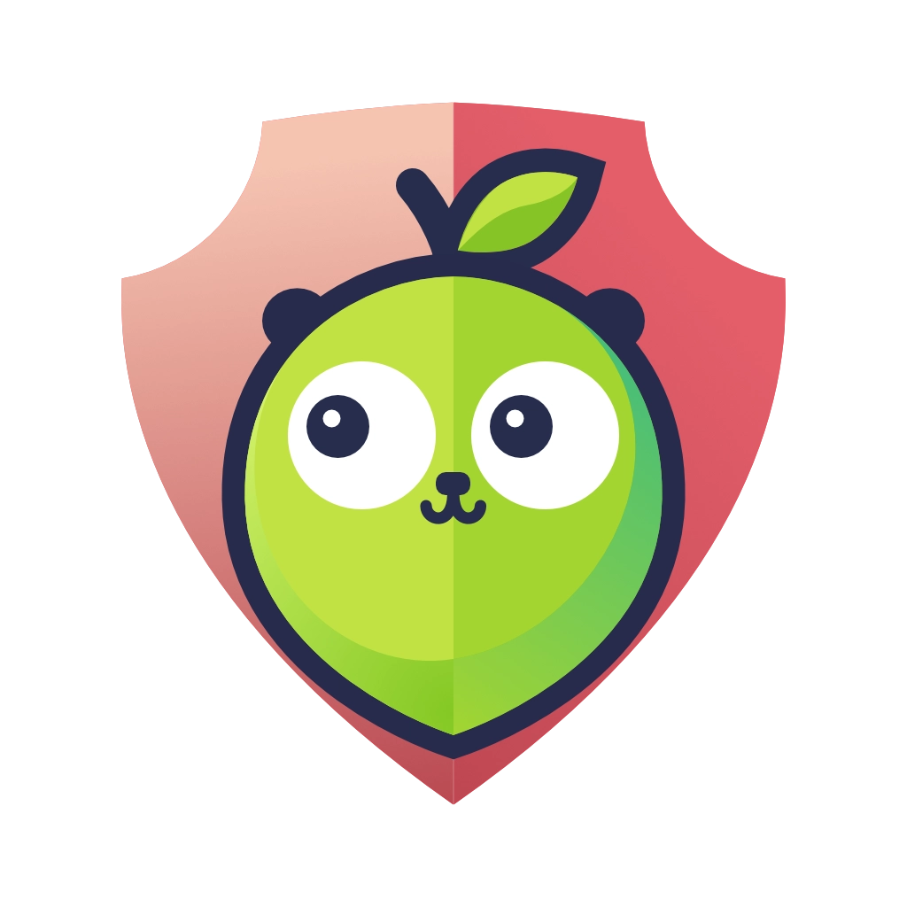
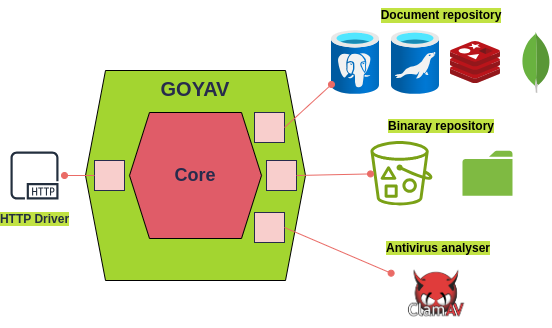

# GOYAV - Go-based middleware for antivirus analysis
<div align="center">
  
</div>

GOYAV is a REST API Middleware designed to connect with antivirus services such as ClamAV. It facilitates secure and efficient data exchange between client applications and antivirus systems, and includes functionality for persistent storage of analysis results.


<div align="center">
  
</div>

<br/>
Key features of GOYAV include:

- **Size limitations for uploads**: To manage resource usage effectively, GOYAV imposes a limit on the size of the files that can be uploaded.
- **Retry mechanism for analysis failures**: In case of an analysis failure, GOYAV implements a retry mechanism to ensure that temporary issues don’t lead to unanalyzed files.
- **Hash check to avoid redundant analysis**: GOYAV avoids unnecessary reanalysis by checking the hash of each file; if a file with a known analysis result is re-uploaded, it reuses the existing result.
- **Scalability**: Being stateless, GOYAV can be horizontally scaled to handle increased load, making it suitable for a wide range of deployment scenarios.

- **Configurable TTL and automatic purging**: GOYAV offers a customizable time to live for analysis results, automatically removing expired data from the system for optimal resource management.


Developed with a hexagonal architecture, GOYAV is versatile and compatible with various antivirus analyzers, databases, and file repositories. For more insights into its architectural design, see the [Architecture section](#architecture).

## How to use GOYAV

GOYAV provides an easy-to-use interface for document uploading and antivirus scanning through its REST API. This guide will walk you through the steps to effectively use GOYAV.

### API specification

For in-depth details about the API, including endpoints, parameters, and response formats, refer to the [GOYAV API Specification](./resources/api/swagger.yml).


### Step-by-Step usage guide

#### Step 1: upload a dcument
To upload a file to GOYAV, use the following curl command. In this example, we're uploading an EICAR test file.
```bash
curl -X POST http://localhost:80/documents \
  -H "Content-Type: multipart/form-data" \
  -F "tag=my_file" \
  -F "file=@eicar.com.txt;type=application/octet-stream"
```
#### Step 2: retrieve the document ID
After uploading, you'll receive a JSON response containing the document ID. Here's an example of such a response:

```json
{
  "message": "document uploaded successfully.",
  "id": "RNiGEv6oqPNt6C4SeKuwLw"
}
```
#### Step 3: get antivirus analysis results
To obtain the results of the antivirus analysis for your document, use the document ID as follows:

```bash
curl http://localhost:80/documents/RNiGEv6oqPNt6C4SeKuwLw
```
You will receive a response like the one below, which includes details such as the document's hash, analysis status, and timestamps:
```json
{
  "message": "document found",
  "document": {
    "id": "RNiGEv6oqPNt6C4SeKuwLw",
    "hash": "275a021bbfb6489e54d471899f7db9d1663fc695ec2fe2a2c4538aabf651fd0f",
    "hash_algo": "SHA-256",
    "tag": "my_file",
    "analyse_status": "infected",
    "analyzed_at": "2024-03-18T01:21:23Z",
    "created_at": "2024-03-18T01:21:23Z"
  }
}
```

## Building and running GOYAV

### Compiling the executable
- **Direct Build**: Compile using Go 1.22+:
    ```bash
    go build -C src/cmd -o ./goyav
    ```

- **Using Taskfile**: If you have [Task](https://taskfile.dev/) installed, use this [Taskfile.yml](./Taskfile.yml):
    ```bash
    task build
    ```

### Docker integration
GOYAV can be containerized using Docker. To create a Docker image:

1. Confirm Docker is properly set up.
2. Build the image with the Taskfile:
    ```bash
    task mk_image
    ```

## Configuring the environment

Set up and customize GOYAV through environment variables for maximum flexibility.

Start by accessing the environment variable template file at  [template.env](./resources/docker/template.env).
### Environment variables

#### General configuration

- `GOYAV_DEBUG_MODE` (optional): Enables debug mode. Set to `true` to activate. Default is `false`.
- `GOYAV_HOST` (optional): Host address for the API server. Default is `localhost`.
- `GOYAV_PORT` (optional): Port for the API server. Default is `80`.
- `GOYAV_VERSION`: Version of GOYAV.
- `GOYAV_INFORMATION`: Additional information about GOYAV.

#### File upload and analysis configuration

- `GOYAV_MAX_UPLOAD_SIZE` (optional): Maximum size for file uploads, in bytes. Default is 1 MiB (1048576 bytes).
- `GOYAV_UPLOAD_TIMEOUT` (optional): Time limit for file uploads, in seconds. Default is `10` seconds.
- `GOYAV_RESULT_TTL` (optional): Duration to keep an analysis result in the system. Format: `[0-9]+(s|m|h)`, e.g., `2h50m10s`. A strictly positive value triggers periodic purging of the repository from documents
with expired TTL. Negative or zero values are interpreted as disabling this purge, allowing documents to persist indefinitely.


#### Performance

- `GOYAVE_SEMAPHORE_CAPACITY` (optional): Number of parallel goroutines that the server can run. Default is `128`.

#### S3 object storage configuration

- `GOYAV_S3_HOST` (optional): Host address for S3 object storage. Default is `localhost`.
- `GOYAV_S3_PORT` (optional): Port for S3 object storage. Default is `9000`.
- `GOYAV_S3_ACCESS_KEY`: Access key for S3 storage.
- `GOYAV_S3_SECRET_KEY`: Secret key for S3 storage.
- `GOYAV_S3_BUCKET_NAME`: S3 bucket name.
- `GOYAV_S3_USE_SSL`: (optional) Set to `true` to use SSL for S3 connections. Default is `false`.

> **Important**: Ensure that the S3 credentials provided to GOYAV have the necessary permissions to read the contents of the specified bucket, or to create a new bucket if one with the provided name doesn't exist.

> **Note**:  Files in the S3 bucket are temporary and are deleted by GOYAV after antivirus analysis and result recording.

#### PostgreSQL database configuration

- `GOYAV_POSTGRES_HOST` (optional): Host address for the PostgreSQL database. Default is `localhost`.
- `GOYAV_POSTGRES_PORT` (optional): Port for the PostgreSQL database. Default is `5432`.
- `GOYAV_POSTGRES_USER`: Username for the PostgreSQL database.
- `GOYAV_POSTGRES_USER_PASSWORD`: Password for the PostgreSQL database user.
- `GOYAV_POSTGRES_DB`: PostgreSQL database name`
- `GOYAV_POSTGRES_SCHEMA`: Schema name in the PostgreSQL database.
- `GOYAV_POSTGRES_SSL_MODE`: (optional): PostgreSQL SSL Mode. Default is `require`. Other options are `disable`, `verify-full` and `verify-ca`.

> **Important**: Ensure that the specified PostgreSQL user has sufficient privileges to create tables and indexes.

#### ClamAV antivirus configuration

- `GOYAV_CLAMAV_HOST` (optional): Host address for the ClamAV service. Default is `localhost`.
- `GOYAV_CLAMAV_PORT` (optional): Port for the ClamAV service. Default is `3310`.
- `GOYAV_CLAMAV_TIMEOUT` (optional): Timeout for ClamAV analysis, in seconds. Default is `30`.


## Architecture

GOYAV uses an hexagonal architecture pattern, consisting of:

- [**core**](/src/internal/core) containing domain logic and port interfaces.
- [**adapters**](/src/internal/adapter) for interaction with a variety of external components such as antivirus services (for example, ClamAV or others), databases (such as PostgreSQL, MySQL, Redis), and binary data repositories (including file storage and object storage buckets like Minio).
- [**service**](/src/internal/service) implementing business logic: this includes managing file uploads, initiating antivirus scans, and securely storing the analysis results.

<div align="center">
  
</div>

### Best Practices in GOYAV Implementation

GOYAV implements several best practices in its antivirus analysis to ensure efficiency and robustness:

- **Asynchronous Analysis**: GOYAV performs the antivirus analysis asynchronously, allowing the upload process to complete without waiting for the analysis to finish.

- **Timeout for Antivirus Service**: A specific timeout is set for the antivirus service to ensure system responsiveness.

- **Parallel Process Limitation (semaphore)**: A semaphore mechanism limits the number of parallel analysis processes, preventing overloading and ensuring efficient resource allocation.


## Extending GOYAV with new adapters

The community is welcomed and encouraged  to contribute to GOYAV by developing new adapters. The hexagonal architecture of GOYAV is designed to be flexible and extendable, allowing for easy integration of various external systems and services.

### Areas for extension

You can contribute by creating new adapters that implement the following interfaces:

- [AntivirusAnalyser](/src/internal/core/port/antivirus_analyser.go): Develop an adapter to integrate different antivirus scanning services.
- [BinaryRepository](/src/internal/core/port/binary_repository.go): Create an adapter for alternative binary data storage solutions.
- [DocumentRepository](/src/internal/core/port/document_repository.go): Implement an adapter for various database systems to manage document metadata.
- [DocumentService](/src/internal/core/port/document_service.go): Enhance the application by developing additional document processing services.

### How to contribute

1. **Fork the repository**: Start by forking the GOYAV repository.
2. **Develop our Adapter**: Follow the existing coding standards and project structure.
3. **Test your Code**: Ensure your adapter works as expected and passes all tests.
4. **Submit a pull request**: Once you're satisfied with your adapter, submit a pull request for review.

Your contributions will help make GOYAV more versatile and robust, catering to a wider range of use cases and scenarios.
